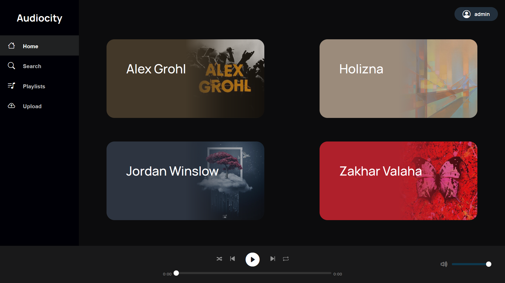
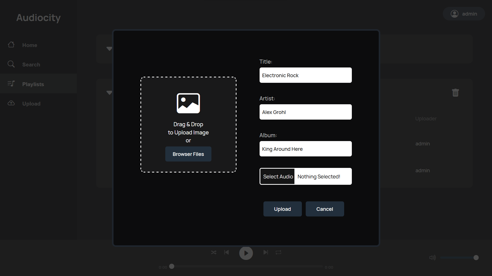

# Audiocity

This project attempts to create a music streaming website using React, Node.js and PostgreSQL.

https://audiocity.onrender.com/

## Screenshots

## Installation

This project is still under development, and as such, official releases are not available for now. Those who are interested in testing or contributing to the project may download and build the project.

## Contributing

To contribute to this project, please create a fork of the main branch and make changes there. Once you are done, create a pull request. A member of the development team will review the changes as soon as possible and will integrate it if it is accepted.
